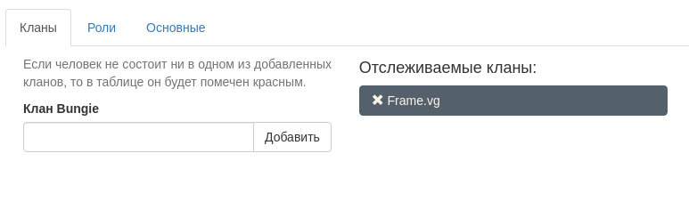
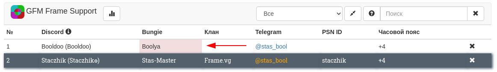

# Отслеживание кланов Bungie
В [настройках бота](https://frame.vg/bot-settings), на вкладке "Кланы" можно задать кланы Bungie которые будут отслеживаться.

	<figure class="figure">
		
		<figcaption class="figure-caption text-center">Настройка отслеживания кланов</figcaption>
	</figure>

Если зарегистрированный член Discord сервера покинет один из указанных кланов Bungie, то его ник Bungie в таблице будет красным:

	<figure class="figure">
		
		<figcaption class="figure-caption text-center">Ячейка клана красная</figcaption>
	</figure>

