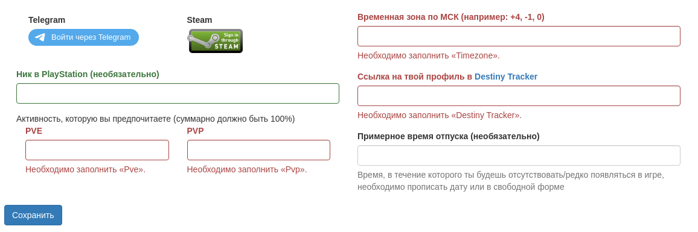
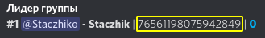

# Регистрация

## Команда !регистрация
Регистрация нужна для привязки Discord аккаунта к аккаунту Bungie, Telegram и Steam. Telegram и Steam по желанию.
  
В директ будет отправлена ссылка, по ней нужно перейти. Выполнить вход в Bungie и заполнить небольшую форму:
  
  
После регистрации человек попадает в таблицу, доступную по <a href="https://frame.vg/members" target="_blank">ссылке</a>. 
Данные указанные в форме будут в таблице. 
Таблицу могут просматривать только зарегистрированные члены discord сервера. 
У каждого сервера своя таблица. 
Таблица одного сервера недоступна другому серверу.
## Количество пройденных рейдов
После регистрации в сообщении сбора будет показываться количество завершенных рейдов:  
 
## Привязка Steam
Если в форме выполнить вход в steam, то в сообщениях сбора будет указываться steam id:  
  
