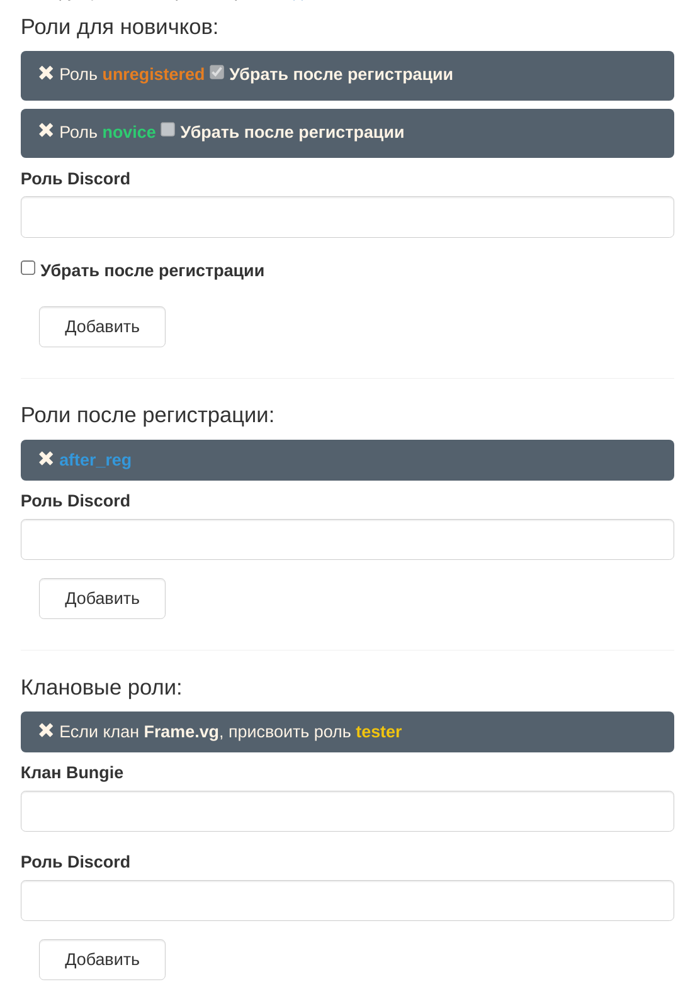

# Раздача ролей
На [странице настроек](https://frame-b.ru/bot-settings), на вкладке "Роли", можно настроить правила раздачи ролей. На данный момент есть три типа правил:

### 1. Роли для новичков
Эти роли будут выдаваться людям которые вошли на discord сервер. Если отметить "Убрать после регистрации", то после регистрации эта роль будет убрана.

### 2. Роли после регистрации
Эти роли будут будут выдаваться после регистрации (см. команда !регистрация).

### 3. Клановые роли
Роли которые зависят от клана Bungie.

    <b><a href="#внимание" class="header">Внимание</a></b>
	<li>Discord роль должна быть уникальной, т.е. не должно быть двух ролей с одинаковыми именами.
	<li>Клан Bungie чувствителен к регистру, его следует вводить в точности, как он написан на сайте Bungie.

### Пример

	<figure class="figure">
		
		<figcaption class="figure-caption text-center">Пример настройки правил</figcaption>
	</figure>

В примере выше: 
- Роли **novice** и **unregistered** будут добавлены новичкам сервера, но только роль **unregistered** будет снята после регистрации
- Также после регистрации добавится роль **after_reg**
- Если человек состоит в Bungie клане **frame**, то он получит роль **tester**
- Если человек не состоит в клане **frame**, то роль **tester** не будет добавлена
- Если у человека есть роль **tester** и он не состоит в клане **frame**, то после регистрации роль будет снята

## Команда !обновить-роли
Если после регистрации или смены клана роли долго не обновляются, воспользуйся командой `!обновить-роли`. Администратор может обновить роли другому члену сервера с помощью команды `!обновить-роли @Nickname`.
