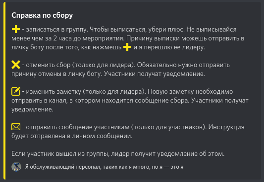
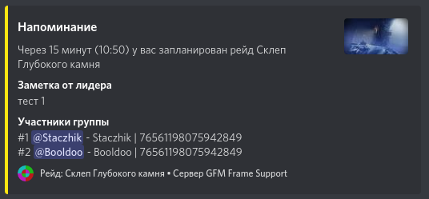

# Сбор группы
## Команда !сбор
`!сбор <активность> <дата>-<время> [заметка]` 
**Активность** - сокращенное название активности. Актуальный список сокращений можно посмотреть командой `!активности`. 
**Дата** - дата в формате *ДД.ММ*. Например *29.02* 
**Время** - время в формате *ЧЧ:ММ*. Например *23:40* 
**Заметка** - заметка (необязательно) 
Например `!сбор сгк 01.06-20:00 Заметка` 
## Справка
Если нажать на  то личным сообщением будет отправлена справка:  

## Напоминание
За 15 минут до начала рейда бот присылает напоминание:  

