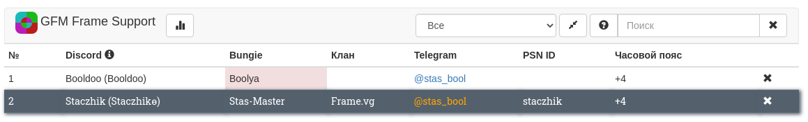
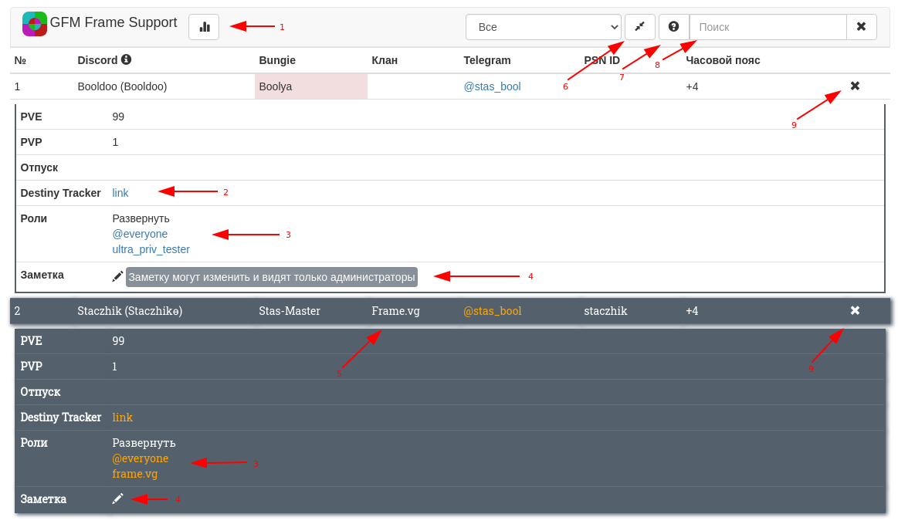

# Таблица участников
После регистрации человек попадает в таблицу. Например:

Администраторы выделены серым цветом.
По клику на строку таблицы доступна подробная информация:

1. Статистика клана
2. Ссылка на страницу DestinyTracker. Указывается при регистрации
3. Список ролей на сервере
4. Заметка об участнике. Видна только администраторам
5. Если человек состоит в клане Bungie, клан будет в этой ячейке. Для этого клан должен быть добавлен в отслеживаемые (см. Отслеживание кланов Bungie)
6. Свернуть все строки
7. Справка по возможностям поиска
8. Поле поиска. Искать можно по роли, клану, нику, телеграму и т. п.
9. Удалить участника из таблицы